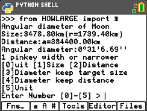

# Angular Diameter Calc

Angular Diameter Calc shares a small python program HOWLARG.py, which calculates how we see distanced objects by angular diameter. It calculates actual size or distance by setting angular diameter.



## Prompt

HOWLARGE.py shows the Angular Diameter of the Moon looking from the Earth on startup prompt.

```
Angular diameter of Moon
Size:3,478.80km(r=1,739.40km)
Distance:a=384,400.00km
Angular diameter:0°31'6.63''
1 pinkey width or narrower
```

Below this prompt, HOWLARGE.py asks you which parameter you want to set for calculating angular-diameter, size or distance.

```
[0]uit [1]Size [2]Distance
[3]Diameter keep target size
[4]Diameter keep distance
[5]Unit
```

## Calculating Angular Diameter of Earth looking from Moon

If you want to calculate the angular diameter of the Earth from moon, you only set [1]Size to the Earth's one.

```
Enter Number [0]-[5] > 1
Enter radius of target >> 12742

Size:12,742.00km(r=6,371.00km)
Distance:a=384,400.00km
Angular diameter:1°53'57.53''
pinkey - thumb witdh
```

Angular diamater 1°53' is same with the width of your thumb on streaching arms.  You can describe as following.

> The Earth looks bigger than I expected.  It was the same size of my thumb.

## Calculating distance toward Boeing 777 from Angular Diameter

If you want to know the distance of airplane from angular diameter, aka looks, set the [3]Diameter keep target size.  Try following.

Set the unit to m(meter).
```
Enter Number [0]-[5] > 5
Enter Unit >> m

Size:12,742.00m(r=6,371.00m)
Distance:a=384,400.00m
Angular diameter:1°53'57.53''
pinkey - thumb witdh
```

Set the target size to 63: Length of Boeing 777.
```
Enter Number [0]-[5] > 1
Enter radius of target >> 63

Size:63.00m(r=31.50m)
Distance:a=384,400.00m
Angular diameter:0°0'33.81''
1 pinkey width or narrower
```

Set the [3]Distance keep target size, with comma separated degrees.  20,0,0 means 20°0'0.00’’.  This angular diameter means the object looks same with your span from the top of thumb to pinkie of your hand on outstretched arm.

```
Enter Number [0]-[5] > 3
Enter Delta in D,M,S >> 20,0,0

Size:63.00m(r=31.50m)
Distance:a=181.40m
Angular diameter:20°0'0.00''
index-pin ~ thumb-pin span
```

You get the 181m and can describe it.

> Boeing flew over me looked as the palm span.  Could I sneak stealthily to reach there?  Is could be 150m, or longer?

